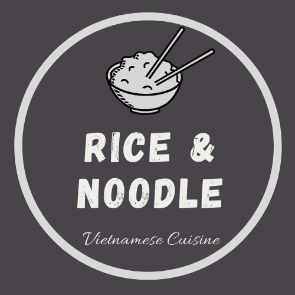

# RICE & NOODLE VIETNAMESE RESTAURANT 👨‍🍳
**Live preview: [click me](https://nguyen-challenge-stage2.herokuapp.com/about-us.html)**
## Description
A web app which allows customer to read the restaurant's story, check out the menu and food photos. Moreover, the customer can make a reservation or contact with the restaurant by filling the form.

The web app was built with HTML, CSS, and Boostrap Framework. It has 6 pages in total:
- HomePage
- About Us
- Menu
- Gallery
- Reservation
- Contact

## Technical skills
- HTML
- CSS
- Bootstrap

## Tools Used
1. Bootstrap Icon
2. VS Code (Code Editor)
3. Canva (Logo, Presentation)
4. Cloudinary (Images storage)

## Ideas
In Berlin, we have a really huge Vietnamese community. You can easily find a Vietnamese restaurant or Imbiss on every corner of the city. However, when I came to cross their address on Google and try to find their website to check whether, for the food, the price, or their history, not all of them have their own website or even they have, but neither up-to-date nor attractive as their foods.

Reasons:
- Technology: It's not their strength.
- Cost: They can't afford the cost of building, maintaining, and updating the website.
- Language barrier: Foreign languages are always a big challenge, German included.
- Marketing: Customers like checking the restaurant website nowaday.

## Solution
1. Help them build fully functional and responsive website
- Modern Website
- Low Cost
- Save Time
- Support up-to-date
- Receive the online reservation
- Increase the number of visitors, increase sales

2. What I want to do more on their online platform.......
- Manage the staffs' working shifts
- Manage the warehouse stock of ingredients, material, equipments..
