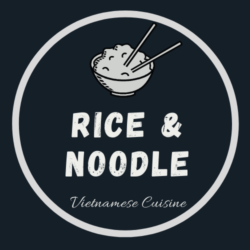

# RICE & NOODLE VIETNAMESE RESTAURANT 👨‍🍳
**Live preview: [click me](https://nguyen-challenge-stage2.herokuapp.com/about-us.html)**
## Description
A web app which allows customer to read the restaurant's story, check out the menu and food photos. Moreover, the customer can make a reservation or contact with the restaurant by filling the form.

There will be 6 pages in the website:
- HomePage
- About Us
- Menu
- Gallery
- Reservation
- Contact

The web app was built with HTML, CSS, and Boostrap Framework.

## Technical skills
- HTML
- CSS
- Bootstrap

## Tools Used
1. Bootstrap Icon
2. Code Editor: VS Code
3. Canva (logo, presentation)
4. Cloudinary (images storage)
